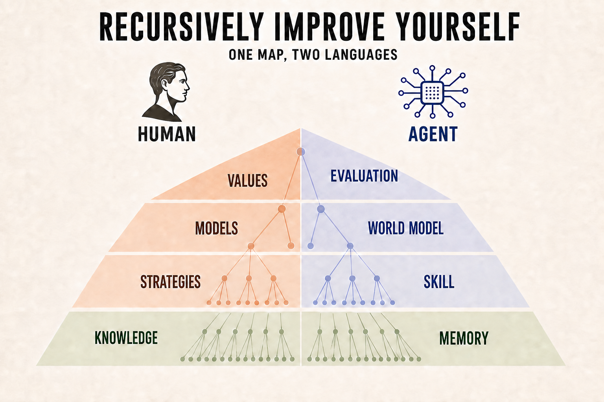

# Recursively Improve Yourself

[English](README.md) · [简体中文](README.zh-CN.md)

### Improve how you act and understand the world. Then improve how you improve.

**Changing a strategy or mental model once took years of painful trial and error. Often, you needed an experienced person who had the time and patience to teach. AI can now help you examine and revise both, sooner and at far lower cost.**

[Explore the map](#one-map-two-languages) · [Try the public demo](https://rsi-yourself.moyi-aw-d.chatgpt.site)

Read this as an invitation: recursively improve yourself.

In ordinary RSI, a model improves the process that improves it. Here, you are the model.

People have always changed their strategies and mental models. What made it hard was finding enough evidence and making sense of it. You either learned through **years of failure**, or found someone experienced who had the time and patience to teach you.

AI changes the price of that work. It brings more knowledge than any one person can usually bring to a conversation. It can stay with the messy details, question your assumptions, and help you design a small test. You may see the lesson before it has to hurt.

In RSI Yourself, the collaboration works like this:

- **You notice** a pattern, a problem, or a question worth investigating.
- **AI examines** the model or strategy you already use, points out what may be wrong or missing, and helps you revise it.
- **Reality tests** the revision in two ways. First, look back at past experience and see whether the new explanation fits better or the new strategy would have worked better. Then, if needed, run a small, low-cost **probe** to see whether it holds up in practice.

You decide what matters. You also decide whether the evidence supports keeping the revision, changing it again, or rejecting it.

## One map, two languages

Start with what happened, then work upward:

1. **Knowledge** records what happened in this case, before you decide what it means.
2. **Strategies** turn that lesson into something you can do again.
3. **Models** explain why the problem happened and what you expect in similar cases.
4. **Values** decide which tradeoffs make the rest worth doing.

The labels help locate the change. They do not need to shape the conversation. In practice, strategies and models usually move together:

> **You:** "I saw a post saying, '[The death of Google and browser-based search is near.](https://x.com/rowancheung/status/1640430038985199616)' Plugins really have been everywhere lately, and I already use GPT for a lot of searches. So I panicked a little. Things are changing so fast, and now even Google is supposed to be dying. What am I supposed to do with that?
>
> At the same time, it clearly does not sound right. I just cannot say where it goes wrong. I keep opening posts like this even though they usually turn out to be nothing much. But then I think: what if this is the one genuinely important update, and I miss it?"
>
> **RSI Yourself:** "You already sense that the headline is probably wrong. The trouble is, you cannot put your finger on exactly where it goes wrong, and you worry that this might be the one time your instinct is wrong. Most posts announcing that everything has changed turn out to be nothing much. But AI has produced a few sudden, important changes. That makes every new alarm harder to dismiss. Opening it costs a few minutes. Missing the rare one that matters feels as if it could leave you behind. Checking them all starts to feel like the safer choice.
>
> Now look at this post. It was published in March 2023, and there was a real report underneath it: someone had found more than 80 unreleased ChatGPT plugins. It was reasonable to think that AI would take on more search and tool use. But saying that Google and browser search were near death was a prediction, several steps beyond that report. Google could add AI to its own search. Search could change without Google disappearing. Your own move toward GPT search did not mean that the whole market had already moved with you. More than three years later, AI has changed search, but [Google still holds about 91% of the worldwide search-engine market](https://gs.statcounter.com/search-engine-market-share/all/worldwide/2026). The post was not wrong about everything. It caught a real change, then carried it all the way to the most dramatic ending.
>
> You do not have to promise yourself that you will never click again. First check whether the author is describing something that happened or predicting what comes next. If it is a prediction, work backward: what facts support it, and are they enough to justify a conclusion this large? If the reasoning is hard to untangle, give it to AI to check the sources and walk through the steps. Then ask one last question: what would it actually cost me to learn this three days later? A change that really matters will show up again. It may be major without being urgent."
>
> **You:** "So a new product can be real, and the trend can be real, without the predicted ending being about to happen. I should look for the facts underneath a prediction instead of reading it as something that has already happened."
>
> **RSI Yourself:** "Yes. Fact → trend → predicted outcome. The first two may be sound while the last still outruns the evidence."

The conversation suggests two revisions to consider. **Strategy:** when a headline feels urgent, use AI to separate what happened, what trend it may support, and what the author predicts; then ask what waiting three days would actually cost you. **Model:** a real fact can support a trend without making the predicted ending imminent, and an important change rarely depends on catching a single post. You decide whether either revision fits your experience well enough to keep.

## Try it

[Open the public Chinese demo](https://rsi-yourself.moyi-aw-d.chatgpt.site). Start with a recurring problem, a point of confusion, or a reaction you cannot explain. Say what happened, what worries you, and what you currently think. Do not sort it into the four layers first:

> "This happened. Here is what worries me. My guess is..."

If the answer feels wrong, confusing, too long, or beside the point, say so. Bring back any better explanation you think of later. The agent should check it with you, not defend its first answer. You can think out loud; the conversation does not need to follow the diagram.

This is an experimental public trial, not medical, legal, financial, or crisis support.

## Data and privacy

Before the first message, you choose how the trial handles your data:

- **No trace:** the conversation is excluded from history and improvement review. Operational content expires after 24 hours of inactivity. Content-free usage statistics, including an HMAC-protected IP hash, coarse region, token counts, and reliability data, may remain for up to 90 days.
- **Help improve:** the conversation and anonymous device/session information may be kept for up to 90 days so the project owner can review and improve the experience.

Do not submit secrets, identifying information, or sensitive medical, legal, financial, or safety-related details. The project does not publish conversations by default.

## Status

This repository currently publishes the concept and links to the public trial. The website implementation, conversational skill, and case library are intentionally not part of this release.

Use GitHub's **Star** button if you want to follow the project.
